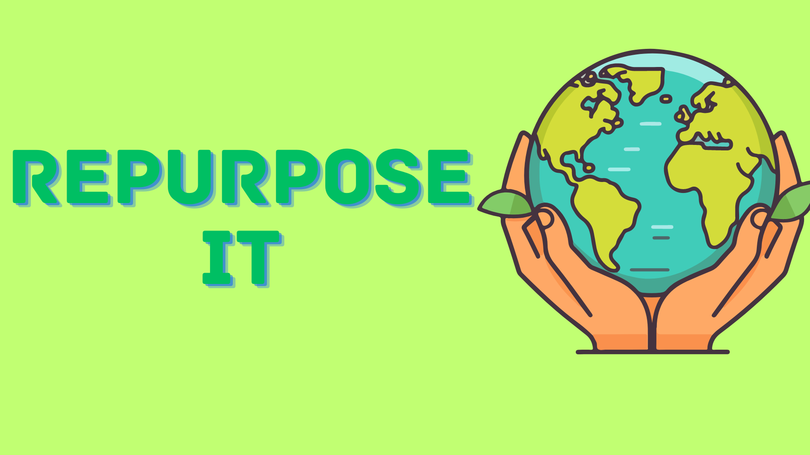

# Repurpose.It

Repupose.It is a revolutionary web application designed to inspire creativity and sustainability in everyday life. With the power of AI and innovative technologies, Repupose.It empowers users to transform waste into valuable resources. Simply upload a picture of any unused item, and receive personalized suggestions on how to repurpose or reuse it effectively. Whether it's turning old containers into planters or upcycling clothing into trendy accessories, Repupose.It provides endless possibilities to reduce waste and contribute to a greener planet.

# Inspiration
The inspiration behind Repupose.It stems from a deep commitment to fostering sustainability, particularly in the context of Africa and the United Nations' Sustainable Development Goals (SDGs). Africa, with its rich diversity of cultures, landscapes, and resources, faces unique challenges and opportunities on the path towards sustainable development.

At the heart of Repupose.It lies the belief that every unused item holds the potential for transformation into something valuable and meaningful. By harnessing the power of technology, including AI and advanced image recognition, Repupose.It aims to empower individuals across Africa and beyond to reimagine waste as a resource, thereby contributing to several key SDGs such as responsible consumption and production (SDG 12), climate action (SDG 13), and sustainable communities (SDG 11).

The platform's focus on creativity, community engagement, and the circular economy aligns with Africa's vibrant entrepreneurial spirit and the growing movement towards sustainable practices. 
.It seeks to inspire a culture of innovation, resourcefulness, and environmental stewardship.
Through collaborative efforts and a shared commitment to sustainable development goals, Repupose.It envisions a future where waste is minimized, creativity flourishes, and communities thrive in harmony with the planet. Together, we can repurpose the way we think about waste and create a more sustainable and inclusive world for generations to come.

# What it does ?
It is a web application that utilizes AI technologies, including OpenAI and Azure Vision API, to analyze uploaded images of unused items. It provides personalized suggestions on how to repurpose or reuse these items creatively. Additionally, the platform features a marketplace where users can showcase and sell their repurposed goods, fostering a circular economy.

# How we built it? 
It involved several key technologies and steps:

- Frontend Development: We used HTML, CSS, and JavaScript to create the user interface (UI) and design elements of the web application. This includes the layout, navigation menus, and interactive features for users to upload images and navigate through the platform.

- Backend Development: The backend of Repupose.It is powered by Flask, a Python web framework. Flask handles the server-side logic, routing, and interactions with the database and AI services. We used MongoDB as our database to store user data, uploaded images, and marketplace listings.

- AI Integration: Repupose.It leverages AI technologies from OpenAI and Azure Vision API. OpenAI's algorithms analyze uploaded images to identify the items and provide personalized suggestions for repurposing or reusing them creatively. Azure Vision API enhances image recognition capabilities, aiding in the AI-powered suggestions.

- Marketplace Functionality: We implemented features to allow users to add their repurposed goods to the marketplace. This involved creating forms for users to input product details, images, pricing, and other relevant information. MongoDB was utilized to store and manage marketplace listings.

# Challenges we ran into
The most difficult part about this project was frontend design as we are not good with frontend development

# Accomplishments that we're proud of
That we were able to build Repupose.It stands proud with its achievements in seamlessly integrating AI technologies for personalized suggestions, creating a user-friendly marketplace for repurposed goods, and fostering an engaged community of sustainability enthusiasts. Its intuitive user interface enhances user experience, while robust scalability and performance ensure reliability even under heavy usage. The platform's positive user feedback reflects its impact in promoting creativity, sustainability, and a circular economy.

# What we learned
We learned to balance technological innovation with sustainability goals and the importance of saving our earth